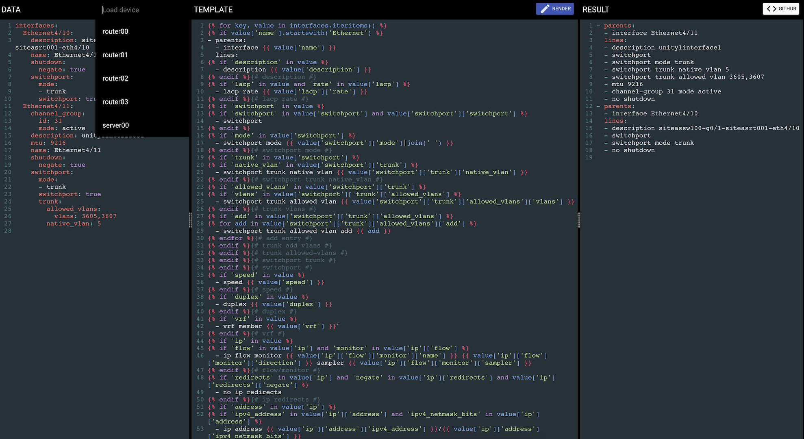

## Template Designer for Automation

### Try it now

https://td4a.now.sh

### Overview

TD4A is a visual design aid for building and testing jinja2 templates.  It will combine data in yaml format with a jinja2 template and render the output.

All jinja2 filters are supported along with the filter plguins from Ansible version 2.4.1.0.

### Installation:

#### using docker:

```
docker pull cidrblock/td4a
```

The docker hub page can be found here:

https://hub.docker.com/r/cidrblock/td4a/

#### using the cli:
```
$ virtualenv venv
$ source venv/bin/activate
$ pip install td4a
```

The pip package can be found here:

https://pypi.python.org/pypi/td4a

### Starting the TD4A server


#### Simple

##### using docker:
```
docker run -p 5000:5000 cidrblock/td4a
```

##### using the cli:
```
td4a-server
```

##### open your browser to:

http://127.0.0.1:5000

#### Loading custom filter plugins

##### using docker:

TD4A will look for custom plugins at /filter_plugins within the container. Pass your custom filter_plugins directory as a volume and expose port 5000.
```
docker run  -p 5000:5000 -v `pwd`/my_filter_plugins:/filter_plugins cidrblock/td4a
```

##### using the cli:

TD4A can load custom filters from a directory specified from the command line:
```
td4a-server -f ./my_filter_plugins
```

#### Loading an ansible inventory

##### using docker:

TD4A will look for custom plugins at /filter_plugins within the container. Pass your custom filter_plugins directory as a volume and expose port 5000.
```
docker run  -p 5000:5000 -v `pwd`/my_filter_plugins:/filter_plugins cidrblock/td4a
```

##### using the cli:

TD4A can load multiple ansible inventories, specifc each with `-i` on the command line:
```
td4a-server -i ./my_ansible_inventory -v 'my_vault_password'
```

#### Enabling storage and links using a couch database

TD4A has the ability to store data and templates in a CouchDB.  This is disabled by defualt.

The CouchDB needs to previously created.

To enable link support, and add the link button to the UI, set the following environ variables:

##### using docker:

```
docker run  -p 5000:5000 \
            -v `pwd`/my_filter_plugins:/filter_plugins \
            -e "COUCH_USERNAME=admin" \
            -e "COUCH_PASSWORD=password" \
            -e "COUCH_URL=http://192.168.1.5:5984/td4a" \
            cidrblock/td4a
```

##### using the cli:
```
export COUCH_USERNAME=admin
export COUCH_PASSWORD=password
export COUCH_URL=http://localhost:5984/td4a
```

### User Interface

The interface is browser based and has been tested using Chrome. If your browser did not automatically open when TD4A was started, you can visit http://127.0.0.1:5000 to see the interface.

The UI is broken into three sections:

1) DATA, this is where the data in yaml format is provided.
2) TEMPLATE, the jinja2 template to be rendered.
3) RESULT, after clicking the render button, the result pane will be populated with the rendered template.

#### Keyboard shortcuts

`cmd+r`: Render the template

`cmd+s`: Save the data in browser local storage

`cmd+b`: Begin new, clear the screen

### Python version

To date, this has only been tested with python 2.7.

### Development

NPM and related packages are required to build the UI.

```
npm install
```

The UI components can be installed for development purposes using bower.

```
bower install
```

The dependancies can be concatenated and minified using gulp.

```
gulp
```
